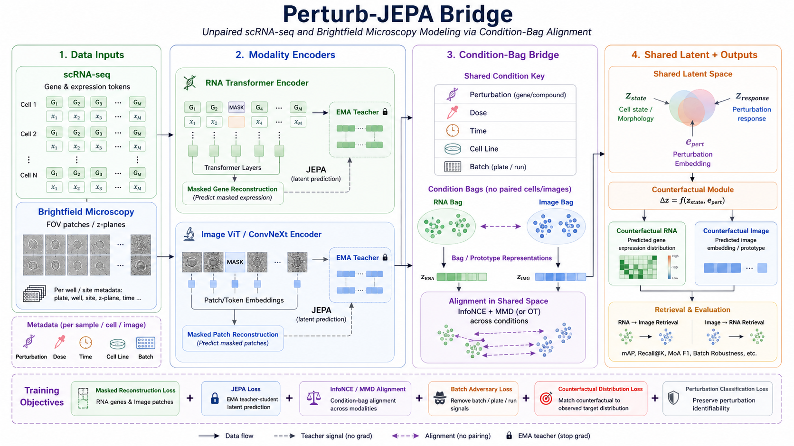

# Perturb-JEPA Bridge

This repository implements the v1 scaffold for unpaired perturbation modeling across
single-cell RNA-seq and label-free microscopy. RNA and image encoders are trained
separately with masked reconstruction and JEPA teacher/student losses, then aligned
at the condition-bag level rather than by assuming paired cells and images.

The code is intentionally data-source agnostic. It provides normalized manifests,
group-safe splits, PyTorch model modules, losses, metrics, and a synthetic smoke
training entrypoint.

<p align="center">
  
</p>

## Install

```bash
python -m pip install -e ".[data,dev]"
```

## Data Interfaces

Expected scRNA `AnnData` metadata:

```text
obs: perturbation, perturbation_type, dose, time, cell_line, batch
var: gene_id, gene_symbol
```

Expected image manifest columns:

```text
image_path, plate, well, site, channel_or_z, perturbation, compound, moa,
target_gene, dose, time, cell_line, batch
```

The shared condition key is:

```text
perturbation | dose | time | cell_line
```

`condition_key`, `condition_key_fine`, and `condition_id` all use exactly those
four biological fields. `perturbation_type` is available only through the
explicit `condition_key_with_type` column and is not part of the default
biological identity.

## Metadata-First Downloads

The download script prints or runs explicit public download commands. Large
image/RNA files are never pulled by default.

```bash
python scripts/download_public_data.py --dry-run --all
python scripts/download_public_data.py --dry-run --dataset bf-moa-metadata
```

For BF-MoA metadata:

```bash
curl -L "https://ndownloader.figshare.com/files/37984380" -o bf_moa_data_tables.tar.gz
python scripts/build_bf_moa_manifest.py \
  --data-tables bf_moa_data_tables.tar.gz \
  --output bf_moa_manifest.csv \
  --image-root /path/to/extracted/images
```

## Smoke Train

Run a one-step synthetic model check without real data:

```bash
python scripts/train_smoke.py --steps 2
```

For config-driven training with checkpointing:

```bash
python scripts/train_synthetic.py \
  --steps 10 \
  --checkpoint-out checkpoints/synthetic.pt
```

## Google Colab

An end-to-end Colab notebook is available at
`notebooks/perturb_jepa_colab_end_to_end.ipynb`. It clones the repo, installs
dependencies, optionally downloads public data assets, runs synthetic smoke
training, can run real-data RNA/image/bridge/counterfactual stages when file
paths are supplied, evaluates retrieval and counterfactual metrics, and saves
checkpoints/metrics artifacts.

Open it in Colab, set `REPO_URL` to your pushed GitHub repo, and run top to
bottom:

```text
notebooks/perturb_jepa_colab_end_to_end.ipynb
```

The config-driven bridge trainer supports reconstruction warmup/annealing,
optional Kendall uncertainty weighting, and `loss.temperature` for contrastive
alignment. Set `training.objective_schedule.enabled=true` to warm up
reconstruction-only training before ramping in JEPA, alignment, and adversarial
terms.

## Baseline Evaluation

Expression baselines expect `.npy` expression matrices and CSV metadata:

```bash
python scripts/evaluate_expression_baselines.py \
  --train-expression train_expression.npy \
  --train-metadata train_metadata.csv \
  --eval-expression eval_expression.npy \
  --eval-metadata eval_metadata.csv \
  --output expression_baselines.csv
```

Retrieval baselines expect `.npy` embedding matrices and CSV metadata:

```bash
python scripts/evaluate_retrieval_baselines.py \
  --gallery-embeddings image_centroids.npy \
  --gallery-metadata image_metadata.csv \
  --query-embeddings rna_centroids.npy \
  --query-metadata rna_metadata.csv \
  --output retrieval_baselines.csv
```

## Leakage-safe Perturb-JEPA Bridge

Perturb-JEPA should be evaluated as an unpaired, condition-level bridge. Retrieval
scores use RNA and image embeddings only; metadata is reserved for relevance
labels, stratification, and leakage diagnostics. Report RNA->image and image->RNA
Recall@1/5/10, mAP, median rank, same-MoA enrichment when MoA labels are present,
same-perturbation enrichment, and stratified slices for batch, perturbation, dose,
time, and cell line.

RNA cells and microscopy fields are not assumed to be cell-paired or sample-paired.
The bridge aligns biological condition bags, where the biological key is
`perturbation`, `dose`, `time`, and `cell_line`. Technical fields including
`batch`, `plate`, `run`, `well`, `site`, `z_plane`, `sequencing_lane`, and
`library_id` are treated as nuisance metadata and must not enter the biological
condition key or encoder inputs.

Counterfactual predictions are distributional condition-bag predictions, not
individual-cell counterfactual matches. The response module predicts treated
prototype distributions relative to control prototype distributions and reports
uncertainty. Retrieval uses learned RNA/image embeddings only; condition labels
and metadata are used after scoring for ground truth and diagnostics. Metadata-only
and batch-only baselines must be reported next to learned retrieval metrics.

Three lightweight baselines are included:

- `metadata_only_retrieval`: scores only `perturbation`, `dose`, `time`, and
  `cell_line` to expose how much retrieval can be solved by condition metadata.
- `batch_only_baseline`: scores only technical metadata such as batch, plate,
  run, well, site, z-plane, sequencing lane, and library ID to reveal acquisition
  leakage.
- `mean_prototype_alignment`: predicts target-space condition prototypes from
  target metadata groups and evaluates retrieval from those mean prototypes.
  If fit on eval target embeddings it is reported as `mean_prototype_oracle`;
  pass train target embeddings/metadata to report `mean_prototype_trainfit`.

Counterfactual evaluation is split by modality. RNA reports pseudobulk
correlation, logFC correlation, top-k DE overlap, direction accuracy, optional
pathway score correlation, and latent MMD under condition, perturbation,
dose-time, or held-out perturbation grouping. Image embeddings report distance to
the observed bag embedding, true-condition retrieval rank, replicate correlation,
dose/time ordering accuracy, and same-MoA enrichment.

Stage entrypoints support synthetic smoke runs and real-data inputs:

```bash
python scripts/train_pretrain_rna.py --synthetic --steps 1
python scripts/train_pretrain_image.py --synthetic --steps 1
python scripts/train_bridge.py --synthetic --steps 1
python scripts/train_counterfactual.py --synthetic --steps 1
python scripts/train_finetune.py --synthetic --steps 1
```

Real-data examples:

```bash
python scripts/train_pretrain_rna.py \
  --config configs/pretrain_rna.yaml \
  --rna-anndata data/raw/SrivatsanTrapnell2020_sciplex3.h5ad \
  --max-cells 2048 \
  --n-top-genes 512 \
  --checkpoint-out checkpoints/real_pretrain_rna.pt

python scripts/train_pretrain_image.py \
  --config configs/pretrain_image.yaml \
  --image-manifest data/processed/bf_moa_manifest.csv \
  --image-root data/raw/bf_moa_images \
  --max-images 2048 \
  --checkpoint-out checkpoints/real_pretrain_image.pt
```

Bridge and fine-tuning real-data runs require overlapping biological condition
IDs between RNA and image metadata. Real bridge training filters metadata before
condition bags are built. Use explicit split columns or one of the grouped split
strategies:

```text
--split-strategy none|random_grouped|heldout_batch|heldout_perturbation|heldout_dose_time|heldout_cell_line|heldout_moa
--split-col split --train-split-value train --eval-split-value test
--heldout-values drugA,drugB          # dose/time values use dose|time
--heldout-fraction 0.2
```

RNA and image masks are controlled by `data.rna_mask_prob` and
`data.image_patch_mask_prob`. The student sees masked inputs; EMA teachers see
unmasked inputs and produce stop-gradient token/patch latent targets.

```bash
python scripts/train_bridge.py \
  --config configs/bridge_train.yaml \
  --rna-anndata data/raw/matched_rna.h5ad \
  --image-manifest data/processed/matched_image_manifest.csv \
  --image-root data/raw/images \
  --split-strategy heldout_batch \
  --eval-split-value test \
  --checkpoint-out checkpoints/real_bridge.pt

python scripts/evaluate_retrieval.py \
  --checkpoint checkpoints/real_bridge.pt \
  --rna-anndata data/raw/matched_rna.h5ad \
  --image-manifest data/processed/matched_image_manifest.csv \
  --image-root data/raw/images \
  --eval-split-value test \
  --output retrieval_metrics.csv
```

## Main Modules

- `perturb_jepa.data.schema`: metadata validation and condition keys.
- `perturb_jepa.data.conditions`: metadata vocabularies, condition bags, and prototypes.
- `perturb_jepa.data.sampling`: stratified hard-negative sampling for nuisance-matched InfoNCE.
- `perturb_jepa.data.scrna`: `SCRNATokenDataset` and collator for masked gene batches.
- `perturb_jepa.data.images`: `ImageManifestDataset` and collator for label-free image batches.
- `perturb_jepa.data.splits`: group-safe train/val/test splits.
- `perturb_jepa.models.bridge`: dual encoder model with EMA teachers.
- `perturb_jepa.losses`: masked reconstruction, JEPA, hierarchical InfoNCE, sliced Wasserstein, MMD.
- `perturb_jepa.training.trainer`: trainer loop, loss assembly, optimizer steps, and EMA updates.
- `perturb_jepa.training.objectives`: staged objective schedules and Kendall uncertainty weighting.
- `perturb_jepa.training.checkpoint`: checkpoint save/load helpers.
- `perturb_jepa.evaluation.metrics`: RNA/image/cross-modal retrieval, DE recovery, and dose monotonicity metrics.
- `perturb_jepa.evaluation.retrieval`: leakage-safe cross-modal retrieval and enrichment metrics.
- `perturb_jepa.evaluation.rna_counterfactual`: RNA counterfactual profile metrics.
- `perturb_jepa.evaluation.image_counterfactual`: image embedding counterfactual metrics.
- `perturb_jepa.evaluation.baselines`: control mean, perturbation mean, centroid retrieval, and label-shuffle controls.
- `perturb_jepa.baselines`: metadata-only, batch-only, and mean-prototype bridge baselines.

## Recommendation-Driven Features

- Hierarchical condition bags are added at coarse, medium, and fine resolution:
  `condition_key_coarse`, `condition_key_medium`, `condition_key_fine`, plus
  the legacy `condition_key` alias for fine conditions. `condition_key_with_type`
  is a separate opt-in key that also includes `perturbation_type`.
- Alignment can use multi-resolution InfoNCE and sliced Wasserstein bag losses,
  so bags keep distributional spread instead of collapsing only to centroids.
- JEPA is implemented as masked token/patch latent prediction with predictor
  heads and stop-gradient EMA teacher targets; masked reconstruction remains an
  auxiliary objective.
- The bridge model uses a gated additive counterfactual form,
  `delta_z = gate(z_state, e_pert) * W(e_pert)`, with cycle consistency. The
  bridge loss does not train a counterfactual term unless explicit control and
  treated targets are supplied.
- Shared bag embeddings use batch adversarial removal for technical nuisance
  labels; perturbation, dose, time, and cell line are not adversarially removed
  by default.
- Evaluation includes held-out perturbation reporting, cell-line transfer
  status, top-k differential-expression recovery, and dose-response monotonicity.

## Design Guardrails

- Cross-modal alignment is condition-level only; no cell-image pairing is assumed.
- Splits must be grouped by perturbation, dose, time, cell line, and batch.
- Held-out perturbation generalization is not true extrapolation when using only
  perturbation ID embeddings. True held-out perturbation claims require
  descriptor inputs such as chemical fingerprints, gene target embeddings,
  MoA/pathway embeddings, or pretrained perturbation descriptors
  (`model.perturbation.descriptor_dim > 0`).
- Fluorescence channels can be used as optional teacher targets, but label-free
  model input should remain brightfield or phase contrast.
- v1 predicts RNA distributions and image embeddings/prototypes, not full images.

## Citation

If you use this work, please cite:

```bibtex
@software{perturb_jepa,
  author = {Raj, Yash},
  title = {Perturb-JEPA Bridge: Unpaired scRNA-seq and Brightfield Perturbation Modeling},
  year = {2026},
  url = {https://github.com/yashraj59/perturb-jepa-bridge}
}
```
